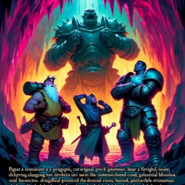

# Talking heroes #
## Dungeon and Dragons mini project ##

                                        |

*Authored by [Lukas Florner](https://www.linkedin.com/in/lukas-florner/)*
*Version: 0.0.1*

## Introduction ##
Multi-agentic application with orchestrated agents able to talk and listen about a situation - a scene inspired by DnD table-top RPG. The game is currently PoC and under development. 

### Agents/Application can: ###
- generate RPG agents: reads complete specification from a text source, prepare character summary (shorter description created by another agent also with picking a name, class and inventory content) and create new agents up to specified count (3 in this case) one by one.
- use tools: list spells in a spellbook, cast a spell, handover the spellbook (or any other tool they have), list inventory and inform others about content.
- be limited in tool usage: when requested action does not comply with the DnD rules and object definition then is denied (allow/deny service is provided by another agent).
- send messages and keep own history of the chat in each RPG agent: talk and listen functionality - it allows a meaningfully looking communication where agents react each other.
- Set initial count of game rounds: game stops when the count is reached or when agents solve the situation and stop signal occurs.
- compute costs: $ and tokens spend for chat with help of LiteLLM callback.
- switch language between English and Czech (Dungeon Master has not been implemented yet - DM's messages remains in English).

### Tech stack: ###
- Class model implementation
- Gradio for GUI
- LiteLLM with expenses overview
- Streaming enabled in multi-class app
- Multi-agent orchestration
- Tool use
